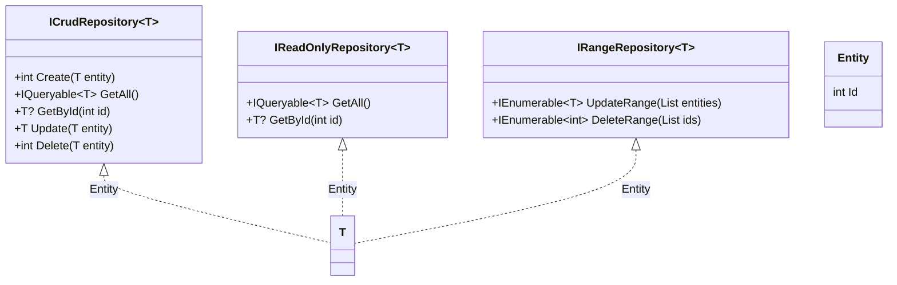

# Data

Data utilities, to be used on data access layer.

## Class Diagram



## Entity

A base for other classes that represents a database entity. Contains an int id property.

[Source code](../src/ArturRios.Common.Data/Entity.cs)

### Usage

```csharp
public class CustomEntity : Entity
{
    public string Name { get; set; }
}
```

## ICrudRepository

An interface for implementing CRUD (Create, Read, Update, Delete) database operations on repository classes. It is generic and requires a type parameter that inherits from the [Entity](#Entity) class.

[Source code](../src/ArturRios.Common.Data/Interfaces/ICrudRepository.cs)

### Usage

```csharp
public class CustomRepository : ICrudRepository<CustomEntity>
{
    private readonly CustomDbContext _dbContext;

    public CustomRepository(CustomDbContext dbContext)
    {
        _dbContext = dbContext;
    }

    public int Create(CustomEntity entity)
    {
        _dbContext.CustomEntities.Add(entity);

        _dbContext.SaveChanges();

        return entity.Id;
    }

    public IQueryable<CustomEntity> GetAll()
    {
        return _dbContext.CustomEntities;
    }

    public CustomEntity? GetById(int id)
    {
        return _dbContext.CustomEntities.Find(id);
    }

    public CustomEntity Update(CustomEntity entity)
    {
        _dbContext.CustomEntities.Update(entity);

        _dbContext.SaveChanges();

        return entity;
    }

    public int Delete(CustomEntity entity)
    {
        _dbContext.CustomEntities.Remove(entity);

        _dbContext.SaveChanges();

        return entity.Id;
    }
}
```

## IReadOnlyRepository

An interface for read-only access to entities. It provides methods to get all entities or get a single entity by id.

[Source code](../src/ArturRios.Common.Data/Interfaces/IReadOnlyRepository.cs)

### Usage

```csharp
public class ReadOnlyRepository : IReadOnlyRepository<CustomEntity>
{
    private readonly CustomDbContext _dbContext;

    public ReadOnlyRepository(CustomDbContext dbContext)
    {
        _dbContext = dbContext;
    }

    public IQueryable<CustomEntity> GetAll()
    {
        return _dbContext.CustomEntities.AsNoTracking();
    }

    public CustomEntity? GetById(int id)
    {
        return _dbContext.CustomEntities.AsNoTracking().FirstOrDefault(e => e.Id == id);
    }
}
```

## IRangeRepository

An interface for batch operations on entities, such as updating or deleting multiple entities at once.

[Source code](../src/ArturRios.Common.Data/Interfaces/IRangeRepository.cs)

### Usage

```csharp
public class RangeRepository : IRangeRepository<CustomEntity>
{
    private readonly CustomDbContext _dbContext;

    public RangeRepository(CustomDbContext dbContext)
    {
        _dbContext = dbContext;
    }

    public IEnumerable<CustomEntity> UpdateRange(List<CustomEntity> entities)
    {
        _dbContext.CustomEntities.UpdateRange(entities);

        _dbContext.SaveChanges();

        return entities;
    }

    public IEnumerable<int> DeleteRange(List<int> ids)
    {
        var entities = _dbContext.CustomEntities.Where(e => ids.Contains(e.Id)).ToList();

        _dbContext.CustomEntities.RemoveRange(entities);

        _dbContext.SaveChanges();

        return entities.Select(e => e.Id);
    }
}
```
