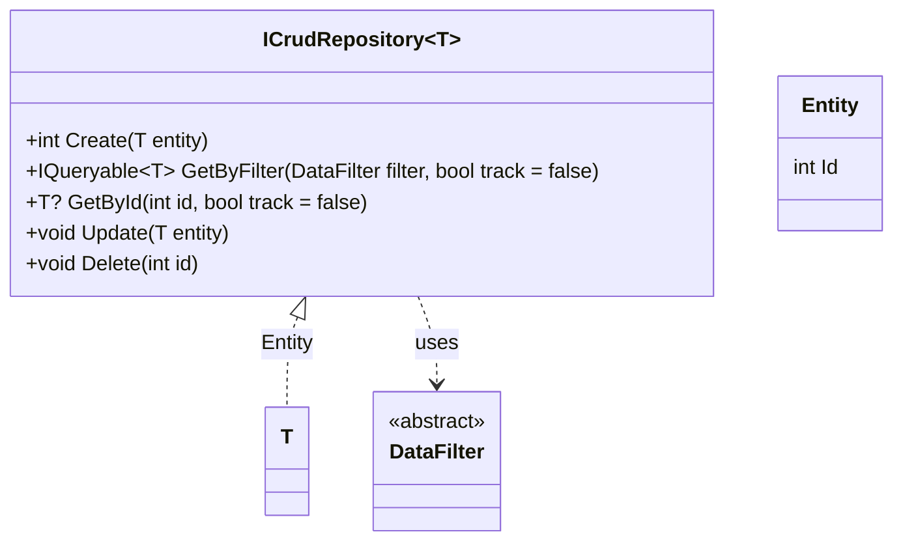

# Data

Data utilities, to be used on data access layer.

## Class Diagram



## Entity

A base for other classes that represents a database entity. Contain an int id property.

[Source code](../src/ArturRios.Common.Data/Entity.cs)

### Usage

```csharp
public class CustomEntity : Entity
{
    public string Name { get; set; }
}
```

## ICrudRepository

An interface that can be used to implement CRUD (Create, Read, Update, Delete) database operations on repository classes.
It's a generic interface that can be used with any class that represents a database entity. It requires a type parameter that must be a class that inherits from the [Entity](#Entity) class.

[Source code](../src/ArturRios.Common.Data/Interfaces/ICrudRepository.cs)

### Usage

```csharp
public class CustomRepository : ICrudRepository<CustomEntity>
{
    public int Create(CustomEntity entity)
    {
        throw new NotImplementedException();
    }

    public IQueryable<CustomEntity> GetByFilter(DataFilter filter)
    {
        throw new NotImplementedException();
    }

    public CustomEntity GetById(int id)
    {
        throw new NotImplementedException();
    }

    public void Update(CustomEntity entity)
    {
        throw new NotImplementedException();
    }

    public void Delete(int id)
    {
        throw new NotImplementedException();
    }
}
```

## Data Filter

An abstract class to use as a base for classes that contains properties to be used as filters on database queries

[Source code](../src/ArturRios.Common.Data/DataFilter.cs)

### Usage

```csharp
public class CustomFilter : DataFilter
{
    public string? Name { get; set; }
    public DateTime? CreationDate { get; set; }
}
```

The DataFilter class is the type of the parameter passed to the [ICrudRepository](#ICrudRepository) method
`GetByFilter`. The following approach is recommended:

```csharp
    public IQueryable<CustomEntity> GetByFilter(DataFilter filter)
    {
        if (filter is not CustomFilter customFilter)
        {
            throw new ArgumentException("Invalid filter");
        }

        var query = _dbContext.Set<CustomEntity>().AsQueryable();

        if (!string.IsNullOrWhiteSpace(customFilter.Name))
        {
            query = query.Where(e => e.Name == customFilter.Name);
        }

        if (customFilter.CreationDate.HasValue)
        {
            query = query.Where(e => e.Name == customFilter.CreationDate);
        }

        return query;
    }
```
